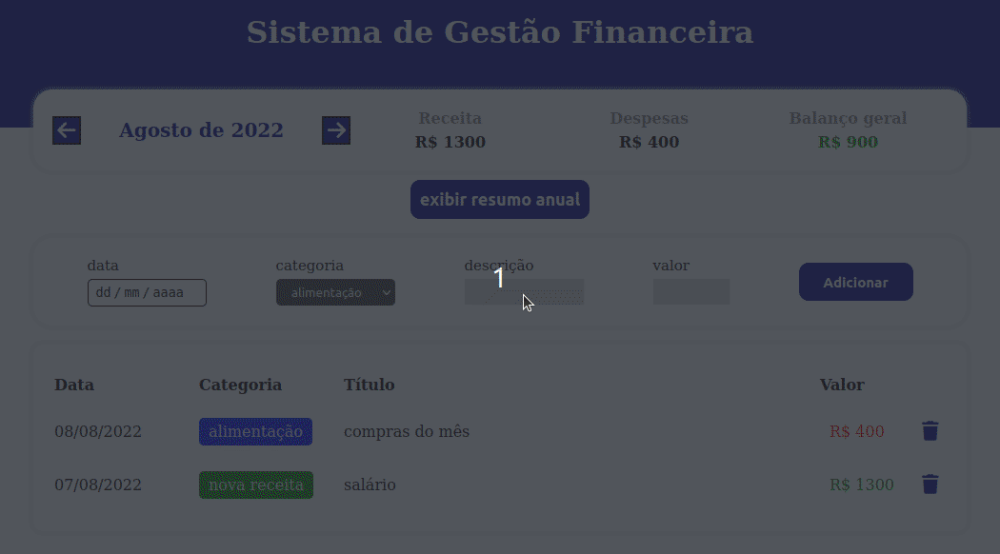

<h1 style='font-size: 40px'>Finance System</h1>

The Finance System is an application that allows you to manage your financial life, storing your monthly expenses and investments; with it you have monthly access to your financial situation and spending history

application example

<h2 style='font-size: 25px'>Main technologies used in application development:</h2>

- React

- Typescript
